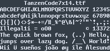

# Tamzen Code
Edit of the [tamzen-font](https://github.com/sunaku/tamzen-font) to be used with IDEs on Windows

### Changes
- No more name clash between different sizes of original TTF
- Properly marked as 'monospaced'
- Tighter vertical margin — should be compatible with font size of 10 pt
- More distinguishable 'M' and 'W'
- Adjusted some of the diacritics
- Re-draw some of the glyphs, e.g. ¤
- Boldface only

### Recommended settings
- General: Font size of 10 pt or 13 px
- IntelliJ: font size of 13 with line height of 1.0
- Sublime Text: 
```
"font_face": "TamzenCode7x14",
"font_options":
[
	"gray_antialias",
	"no_bold"
],
"font_size": 10,
```

### Sample images
